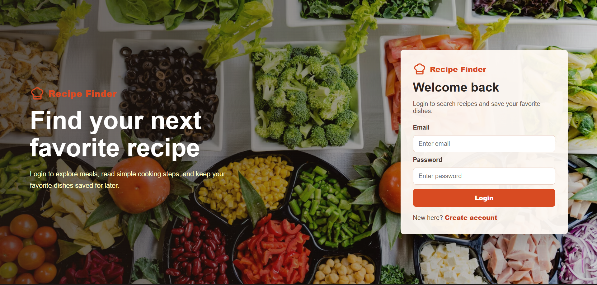
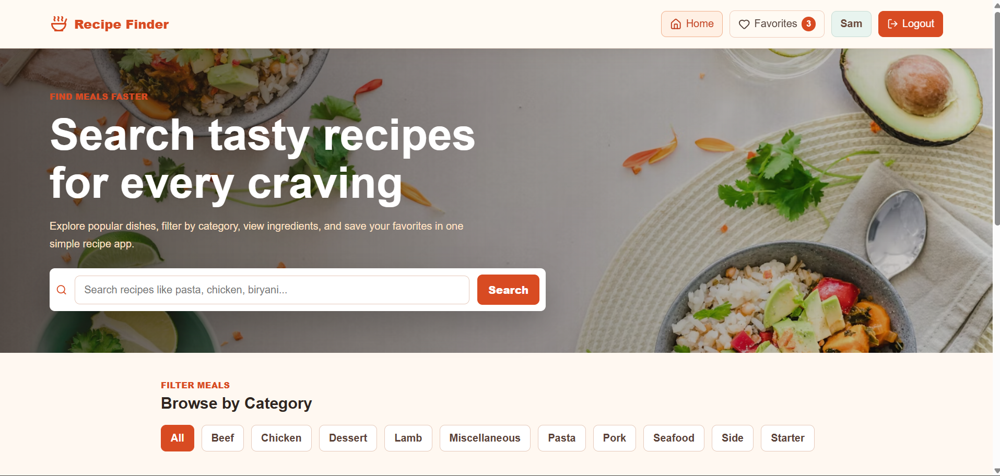
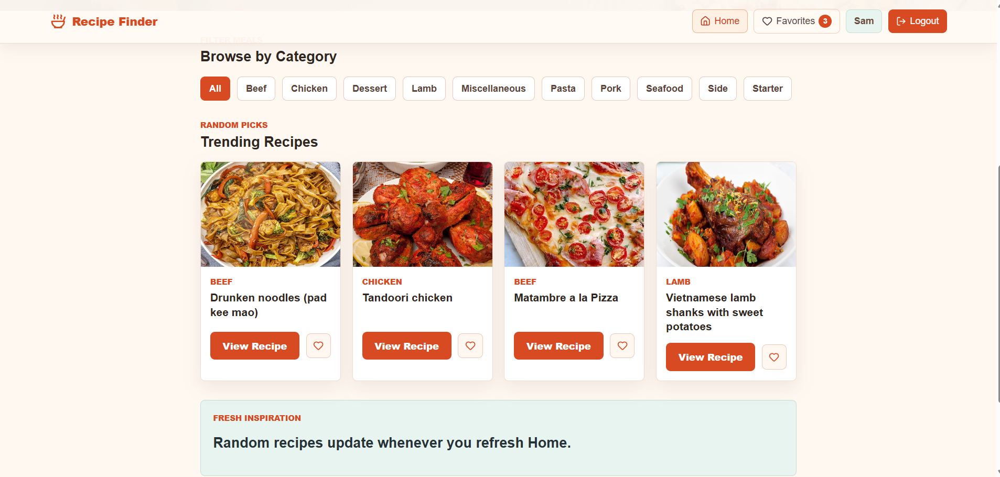
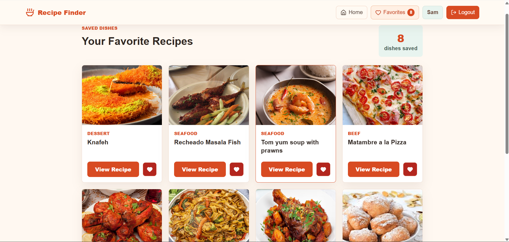
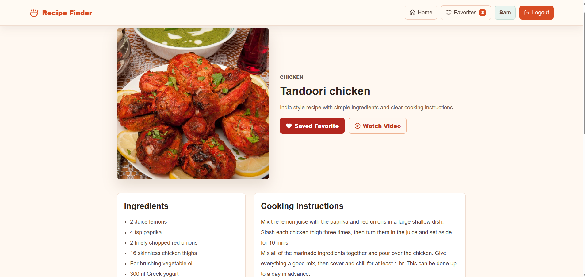
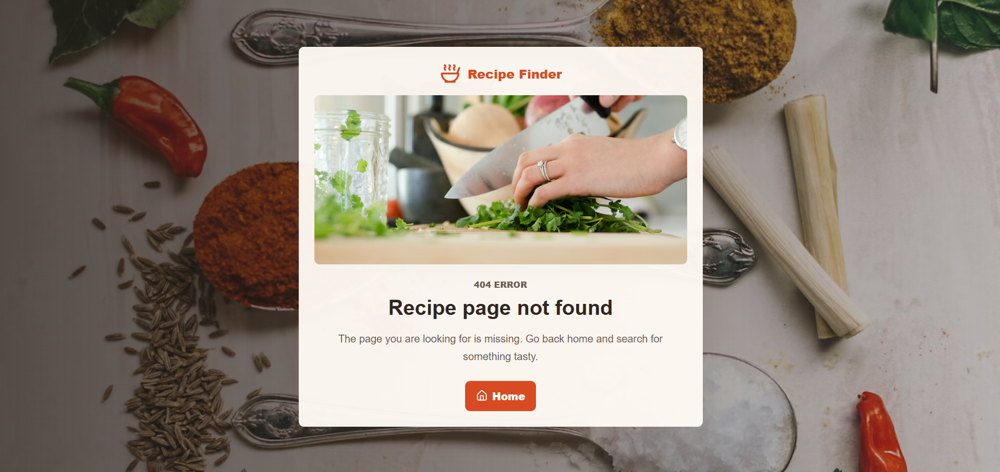
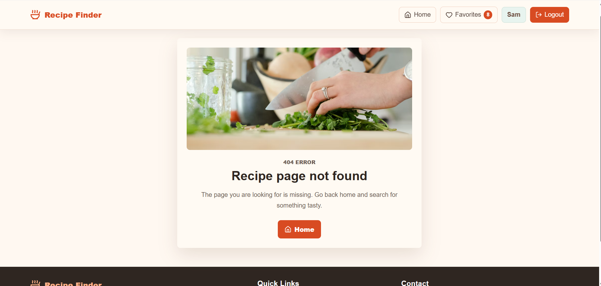

# 🍽️ Recipe Finder App

A modern and responsive **Recipe Finder Web Application** built using **React JS** and **TheMealDB API**.  
Users can search recipes, explore recipe details, browse categories, and save favorite recipes with a clean and professional UI.

---

# 🚀 Live Demo

```txt
Add your deployed project link here
```

# 📂 GitHub Repository

```txt
Add your GitHub repository link here
```

---

# 📌 Features

## 🔍 Recipe Search

- Search recipes dynamically
- Real-time search suggestions
- Responsive recipe grid layout

## 📖 Recipe Details

- Recipe image
- Ingredients list
- Cooking instructions
- Category and cuisine details

## ❤️ Favorites System

- Save favorite recipes using Local Storage
- Remove recipes from favorites
- Persistent favorite data

## 🎲 Random & Trending Recipes

- Display random/trending recipes on homepage
- Dynamic recipe cards

## 📂 Category Filtering

- Filter recipes by categories
- Explore different food types

## 🌗 Modern UI/UX

- Clean and professional design
- Smooth hover effects
- Responsive layouts
- Attractive cards and typography

## 📱 Responsive Design

- Mobile-first design
- Responsive navbar
- Works on mobile, tablet, and desktop

## ⚡ Performance Optimization

- Lazy loading images
- Optimized rendering
- Efficient API handling

---

# 🛠️ Tech Stack

## Frontend

- React JS
- React Router DOM
- Axios
- Framer Motion
- CSS / Tailwind CSS

## API

- TheMealDB API

## Storage

- Local Storage

---

| Technology         | Usage                        |
| ------------------ | ---------------------------- |
| React JS           | Frontend Framework           |
| React Router DOM   | Routing                      |
| Context API        | State Management             |
| Tailwind CSS / CSS | Styling                      |
| Axios / Fetch API  | API Requests                 |
| Framer Motion      | Animations                   |
| TheMealDB API      | Recipes Data                 |
| LocalStorage       | Authentication & Persistence |

---

# 📂 Folder Structure

```bash
src/
 ├── components/
 ├── pages/
 ├── utils/
 ├── assets/
 ├── context/
 ├── App.jsx
 └── main.jsx
```

---

# 🔗 API URLs Used

```js
const BASE_URL = "https://www.themealdb.com/api/json/v1/1";
```

### Search Recipes

```js
`${BASE_URL}/search.php?s=${query}`;
```

### Recipe Details

```js
`${BASE_URL}/lookup.php?i=${id}`;
```

### Random Recipe

```js
`${BASE_URL}/random.php`;
```

### Category Recipes

```js
`${BASE_URL}/filter.php?c=${category}`;
```

---

# 📸 Screenshots

---

## 🔐 Login / Signup Page

---


---



---

## 🏠 Home Page



---

## 

---

## ❤️ Favorites Page

---



---

## 📖 Recipe Details Page



---


---

### Footer Section

---


---

### Not Found Page

---



---



---

# ⚙️ Installation & Setup

## Clone Repository

```bash
git clone https://github.com/AllemSamyel-03/Recipe-Finder-Website.git
```

## Navigate to Project Folder

```bash
cd recipe-finder-app
```

## Install Dependencies

```bash
npm install
```

## Run Development Server

```bash
npm run dev
```

---

# 🌟 Future Improvements

- Dark Mode
- Authentication with Firebase
- Advanced Filters
- Search by Ingredients
- Pagination
- AI Recipe Suggestions

---

# 💼 Skills Demonstrated

- React Hooks
- API Integration
- Responsive Web Design
- State Management
- Component-Based Architecture
- Modern UI/UX Design
- Local Storage Handling

---

# 👨‍💻 Author

Developed by **ALLEM SAMYEL**

GitHub: https://github.com/AllemSamyel-03

Linkedin: https://www.linkedin.com/in/allem-samyel-039655374/

---

# 📄 License

This project is licensed under the MIT License.

# ⭐ Show Your Support

If you like this project, give it a ⭐ on GitHub.
